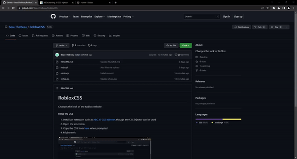

# RobloxCSS
 Changes the look of the Roblox website

#### HOW TO USE
1. Install an extension such as [ABC JS-CSS Injector](https://chrome.google.com/webstore/detail/abc-js-css-injector/dnoagfebjndkhkabjkkoeeijnjpmbimj), though any JS injector can be used
2. Open the extension
3. Copy the JS from [here](roblox.js) when prompted
4. Might work

### Changelog
- 
